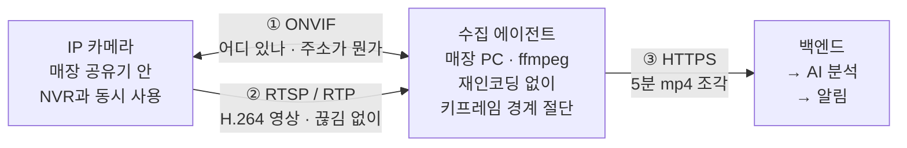
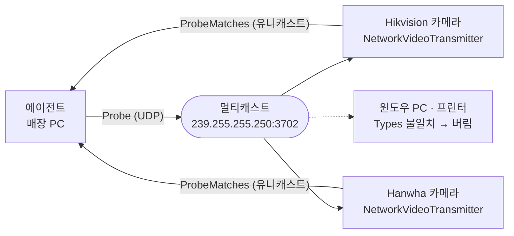
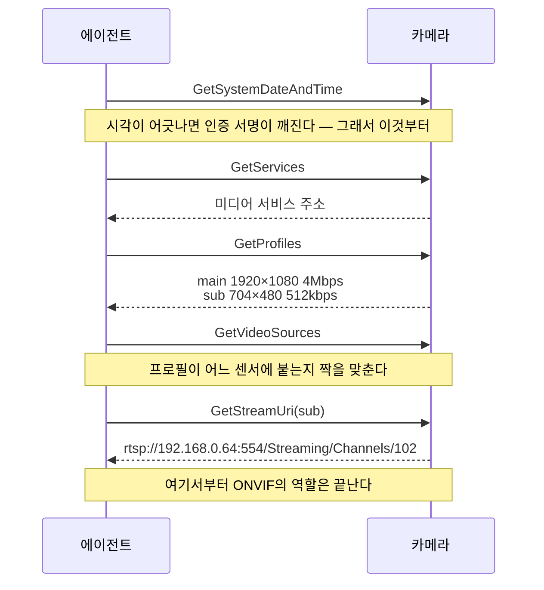
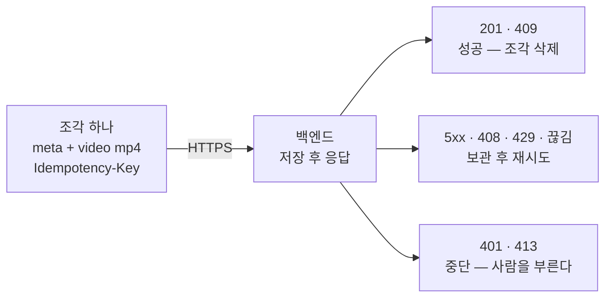
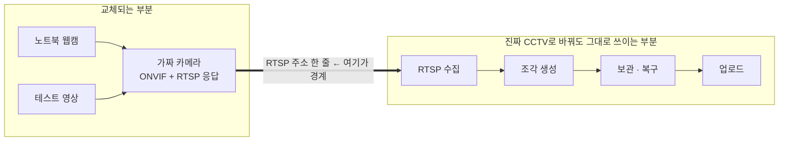

# 카메라에서 백엔드까지

무인매장 CCTV 이상행동 감지 · 수집 에이전트의 프로토콜 흐름과 백엔드 요청 명세.

CCTV는 하나의 프로토콜이 아니다. 카메라를 **찾는** 프로토콜, 카메라에게 **묻는** 프로토콜,
영상을 **나르는** 프로토콜이 따로 있고 각각 다른 계층에서 논다.
이 문서는 수집 에이전트가 그 셋을 어느 순간에 어떻게 쓰는지, 그리고 마지막에
백엔드로 무엇을 보내는지를 정리한다.

- 대상 버전: 수집 에이전트 v1.0.0
- 마지막 수정: 2026-09-08
- 관련: [설계 문서](superpowers/specs/2026-09-07-cctv-ingest-agent-design.md) · [구현 계획서](superpowers/plans/2026-09-07-cctv-ingest-agent.md)

---

## 한눈에

| 단계 | 프로토콜 | 주소·포트 | 무엇을 얻나 |
|---|---|---|---|
| 1. 카메라 찾기 | WS-Discovery (SOAP over UDP) | `239.255.255.250:3702` | 기기 UUID, ONVIF 주소 |
| 2. 카메라에게 묻기 | ONVIF (SOAP over HTTP) | `http://카메라/onvif/…` | 화질 목록과 RTSP 주소 |
| 3. 영상 받기 | RTSP + RTP (TCP 인터리브) | `rtsp://카메라:554/…` | H.264 스트림 |
| 4. 조각내기 | **표준 없음 — 에이전트가 한다** | — | 키프레임 경계 mp4 |
| 5. 백엔드로 | HTTPS (multipart/form-data) | `POST /v1/segments` | — |

색으로 나누면 두 갈래다. **제어**(찾고 묻고 협상)는 1·2단계와 3단계의 앞부분,
**데이터**(영상이 실제로 흐름)는 3단계의 RTP와 5단계의 업로드다.

---

## 전체 흐름



**방향이 카메라 쪽에서 한 번 뒤집힌다 — 이것이 수집 에이전트가 존재하는 이유다.**

RTSP는 *당겨오는* 프로토콜이다. 카메라가 서버로 앉아 있고 에이전트가 접속해 가져온다.
"CCTV가 백엔드로 영상을 보낸다"는 동작은 표준 카메라에 없다.
그래서 당겨와서 밀어넣는 중간 존재가 반드시 필요하다.

---

## 1. 카메라 찾기 — WS-Discovery

에이전트는 카메라의 IP를 모른 채 시작한다. 같은 공유기 안에 "거기 카메라 있나"를 한 번 외치고,
대답한 기기의 주소를 받는다. 프린터를 자동으로 찾는 것과 같은 원리다.



| | |
|---|---|
| 프로토콜 | WS-Discovery (SOAP over UDP) |
| 주소 | `239.255.255.250:3702` 멀티캐스트 |
| 인증 | **없음** — 비밀번호를 묻기 전 단계라 자격증명 없이 동작해야 한다 |
| 얻는 것 | 기기 UUID, ONVIF 서비스 주소(XAddr), 제조사·모델 |

**WS-Discovery는 ONVIF 전용이 아니다.** 같은 주소에 윈도우 PC와 프린터도 대답한다.
그래서 응답의 `Types`에 `NetworkVideoTransmitter`가 있는 것만 카메라로 인정한다.
이 필터가 없으면 사무실 PC가 카메라 목록에 뜬다 — 실제 네트워크에서 겪은 일이다.

> **기기 UUID(`urn:uuid:…`)를 카메라 식별자로 쓴다.**
> IP는 DHCP로 바뀌지만 UUID는 그대로다. IP를 식별자로 삼으면
> 공유기를 재부팅한 다음 날 다른 카메라를 보고 있게 된다.

검색에 잡히지 않는 카메라(ONVIF가 꺼져 있거나 다른 대역)를 위해
**RTSP 주소 직접 입력 경로가 반드시 있어야 한다.** 이 우회로가 없으면 설치 기사가 손을 못 쓴다.

---

## 2. 카메라에게 묻기 — ONVIF

찾았다고 영상을 받을 수 있는 건 아니다. 어떤 화질이 있는지, 각각의 RTSP 주소가 무엇인지 물어야 한다.
아래가 실제로 오가는 순서다.



| | |
|---|---|
| 프로토콜 | SOAP/XML over HTTP (ONVIF Profile S / T) |
| 인증 | WS-Security Digest — 카메라와 시각이 맞아야 통과한다 |
| 고르는 것 | 메인스트림 대신 **서브스트림** — 대역폭 약 1/8, AI 분석에는 충분 |
| 함정 | 일부 제조사는 관리자 계정과 별개로 **ONVIF 전용 계정**을 만들어야 한다 |

**ONVIF는 영상을 한 바이트도 나르지 않는다.** "영상은 저기 있다"는 주소 한 줄을 알려주고 물러난다.
에이전트가 저장하는 것도 그 주소 하나다.

### 메인스트림과 서브스트림

거의 모든 IP 카메라가 스트림을 2개 이상 동시에 낸다.

| | 용도 | 전형적 사양 | 5분 조각 | 카메라 1대 하루 |
|---|---|---|---|---|
| 메인스트림 | 녹화(NVR) | 1920×1080, 4 Mbps | 약 150 MB | 약 42 GB |
| **서브스트림** | 실시간·분석 | 704×480, 512 kbps | **약 19 MB** | 약 5.4 GB |

무인매장 인터넷은 업로드가 느린 비대칭 회선이다. 메인스트림을 상시 업로드하면
매장 회선을 통째로 점유한다. 기본값을 서브스트림으로 두는 실질적 이유다.

NVR이 메인스트림으로 녹화하는 동안 에이전트는 서브스트림을 따로 받아가므로
**기존 CCTV 시스템에 간섭하지 않는다.**

---

## 3. 영상 받기 — RTSP와 RTP

RTSP는 재생기의 리모컨이고, 영상 자체는 RTP가 나른다.
둘은 다른 프로토콜이지만 매장 환경에서는 **같은 TCP 연결 하나**에 섞어 보낸다.
방화벽과 NAT를 뚫는 유일하게 확실한 방법이다.

```mermaid
sequenceDiagram
    participant A as 에이전트 (ffmpeg)
    participant C as 카메라

    A->>C: DESCRIBE
    C-->>A: SDP — 코덱 H.264, 해상도, 파라미터셋
    A->>C: SETUP<br/>Transport: RTP/AVP/TCP;interleaved=0-1
    Note over A,C: "UDP 말고 이 연결에 같이 실어달라"
    A->>C: PLAY
    C-->>A: RTP 패킷
    C-->>A: RTP 패킷
    C-->>A: 끊김 없이 계속…
```

### 같은 TCP 연결에 섞어 보내는 방법 (인터리브 프레이밍)

```
┌──────┬───────────┬────────────┬──────────────────────────────────────┐
│  $   │   채널     │    길이     │  RTP 패킷 (H.264 조각 · RFC 6184)     │
│ 1바이트│ 0=영상     │  2바이트    │  타임스탬프와 일련번호가 붙어 있다      │
│      │ 1=제어(RTCP)│            │                                      │
└──────┴───────────┴────────────┴──────────────────────────────────────┘
```

RTSP 요청과 이 데이터 프레임이 같은 소켓에 번갈아 흐른다.
포트를 하나만 열면 되므로 매장 공유기를 손댈 필요가 없다.
UDP 방식은 포트를 따로 열어야 하고 NAT 뒤에서 자주 끊긴다.

> `-rtsp_transport tcp`는 성능 타협이 아니라 **현장에서 되는 유일한 설정**이다.

| | |
|---|---|
| 제어 | RTSP (RFC 2326 / 7826) · TCP 554 |
| 운반 | RTP — TCP 인터리브로 같은 연결에 실린다 |
| 페이로드 | H.264 → RFC 6184 · H.265 → RFC 7798 |
| 인증 | Digest — ONVIF와 **별개로 다시** 인증한다 |

비밀번호에 `@` `/` `:`가 들어가면 RTSP URL이 깨진다. 반드시 URL 인코딩해야 한다 —
현장에서 흔한 실패다.

---

## 4. 조각내기 — 프로토콜이 아니라 우리 몫

카메라는 연속 스트림만 낸다. 5분씩 자르는 것은 표준에 없고 받는 쪽이 해야 한다.
그리고 **아무 데서나 자를 수 없다** — H.264는 앞 프레임을 참조하기 때문이다.

```
              ┌── 300초 지남
              ↓
 I  P P P  I  P P  …  P P  I  P P P
 ▲                        ▲
 키프레임                  여기서 자른다 (다음 키프레임)
 혼자서 그림이 된다

 I = 키프레임(IDR) — 혼자서 완전한 그림
 P = 앞 프레임과의 차이만 담는다
```

P프레임에서 자르면 앞부분이 없어 그 조각만으로는 디코딩되지 않는다 —
**AI 서버가 열지 못하는 파일**이 된다.

그래서 실제 조각은 설정값보다 조금 길다. 5분 설정에 300~302초가 나오며,
메타의 `durationMs`가 진짜 길이다. 설정값을 가정해 계산하면 안 된다.

재인코딩은 하지 않는다(`-c:v copy`). CPU를 거의 쓰지 않고 화질 손실도 없다.

> **미완성 조각을 올리지 않는 장치**
> ffmpeg는 작업 폴더(`.writing/`)에 쓰고, 조각이 닫혔다는 신호를 받은 뒤에만
> 보관 폴더로 옮긴다. mp4는 재생에 필요한 색인(moov atom)을 파일을 닫을 때 맨 뒤에 쓰므로,
> 쓰는 중인 파일을 올리면 백엔드가 열지 못한다.
> 이 분리 덕분에 "보관 폴더에 있는 파일은 전부 완성본"이라는 불변식이 성립한다.

---

## 5. 백엔드로 — HTTPS

여기서 방향이 뒤집힌다. 카메라에게서는 당겨왔지만, 백엔드로는 에이전트가 밀어넣는다.
표준 프로토콜은 없고 아래 계약을 쓴다. **백엔드는 이 절만 보고 구현할 수 있다.**



### 5.1 엔드포인트

```http
POST {backendBaseUrl}/v1/segments
Content-Type: multipart/form-data; boundary=...
Authorization: Bearer <deviceToken>
Idempotency-Key: <segmentId>
```

`backendBaseUrl`은 매장마다 앱에서 설정한다. 끝의 슬래시는 있어도 없어도 된다.

| 파트 | Content-Type | 내용 |
|---|---|---|
| `meta` | `application/json` | 아래 스키마 |
| `video` | `video/mp4` | 조각 파일. 파일명은 `<segmentId>.mp4` |

### 5.2 meta 스키마

```jsonc
{
  "segmentId": "01K5ZQ8G3M7X2N4P6R8T0V2W4Y",
  "storeId": "store-gangnam-01",
  "deviceId": "agent-7f3k9m2p",
  "camera": {
    "id": "urn:uuid:2419d68a-2dd2-21b2-a205-ec1bd0d0b0ff",
    "name": "계산대",
    "manufacturer": "Hikvision",
    "model": "DS-2CD2143G2",
    "streamProfile": "sub"
  },
  "video": {
    "codec": "h264",
    "width": 704,
    "height": 480,
    "fps": 15,
    "durationMs": 300133,
    "sizeBytes": 19783421,
    "container": "mp4"
  },
  "startedAt": "2026-09-07T14:30:00.000Z",
  "endedAt": "2026-09-07T14:35:00.133Z",
  "sequence": 1284,
  "agentVersion": "1.0.0"
}
```

| 필드 | 타입 | 설명 |
|---|---|---|
| `segmentId` | ULID (26자) | 조각의 전역 고유 ID. `Idempotency-Key` 헤더와 **항상 동일** |
| `storeId` | string | 매장 식별자. 앱에서 설정 |
| `deviceId` | string | 수집기 식별자. 최초 실행 시 자동 생성 후 고정 |
| `camera.id` | string | ONVIF 기기 UUID. **DHCP로 IP가 바뀌어도 유지된다.** 수동 입력 카메라는 RTSP 주소 |
| `camera.name` | string | 사용자가 붙인 위치 이름. 알림에 그대로 노출된다 |
| `camera.manufacturer` / `model` | string \| null | 검색으로 알아낸 값. 수동 입력이면 `null` |
| `camera.streamProfile` | `"main"` \| `"sub"` | 메인스트림(고화질) / 서브스트림(저대역폭) |
| `video.codec` | `"h264"` \| `"h265"` | 재인코딩하지 않으므로 카메라가 낸 코덱 그대로 |
| `video.width` / `height` / `fps` | number | 실제 조각에서 ffprobe로 읽은 값 |
| `video.durationMs` | number | **실제 조각 길이.** 설정값과 정확히 같지 않다 (5.3 참조) |
| `video.sizeBytes` | number | `video` 파트의 바이트 수 |
| `video.container` | `"mp4"` | 현재는 항상 mp4 |
| `startedAt` / `endedAt` | ISO 8601 UTC | 조각의 시작·종료 벽시계 시각 |
| `sequence` | number | `(deviceId, camera.id)`별 0부터의 일련번호 |
| `agentVersion` | string | 수집기 버전 |

### 5.3 백엔드가 반드시 지켜야 할 것

#### 멱등 처리 — 선택이 아니라 필수

같은 `segmentId`를 두 번 받으면 **두 번째는 `409`로 답하고 저장하지 말아야 한다.**

업로드는 성공했는데 응답만 못 받는 경우(회선 순단, 게이트웨이 타임아웃)가 반드시 생기고,
그때 에이전트는 **같은 `segmentId`로 재시도한다.** 걸러내지 않으면 같은 5분이 두 번 분석되어
점주에게 **알림이 중복 발송된다.**

```sql
-- 최소 구현
CREATE UNIQUE INDEX ON segments (segment_id);
-- INSERT ... ON CONFLICT (segment_id) DO NOTHING → 영향 행이 0이면 409
```

#### 조각 길이는 설정값과 정확히 일치하지 않는다

키프레임 경계에서만 자를 수 있으므로(4단계 참조) 실제 길이는 설정값보다 조금 길다.
카메라 GOP가 2초면 5분 설정에서 300~302초 사이가 나온다.
**`durationMs`를 신뢰하고, 설정값을 가정해 계산하지 말 것.**

#### `sequence`는 생성 순서지 도착 순서가 아니다

인터넷이 끊긴 동안 조각은 디스크에 쌓였다가 복구되면 몰려서 올라온다.
번호는 **만들어진 시점** 기준이며 오래된 것부터 전송된다.

- 번호가 건너뛰면 → 그 구간 영상이 유실된 것 (디스크 상한 초과 등)
- 번호가 한참 늦게 도착하면 → 그동안 매장 인터넷이 끊겨 있었던 것

수집기가 재설치되면 번호는 0부터 다시 시작한다.
`(deviceId, camera.id, sequence)`로 묶어 판단할 것.

### 5.4 응답 규격

| 상태 | 의미 | 에이전트 동작 |
|---|---|---|
| `201 Created` | 정상 수신 | 조각 삭제, 다음으로 |
| `409 Conflict` | 이미 받은 `segmentId` | **성공으로 취급**, 조각 삭제 |
| `401` `403` | 토큰 문제 | **재시도 중단**, 화면에 경고. 조각은 보관 |
| `413` | 조각이 너무 큼 | 재시도 중단, 조각 길이 축소 안내 |
| `400` 등 기타 4xx | 규격 위반 | 재시도 중단 |
| `408` `429` | 일시적 | 지수 백오프 재시도 |
| `5xx` | 서버 장애 | 지수 백오프 재시도 |
| 응답 없음 (네트워크) | 인터넷 끊김 | 조각 보관 후 지수 백오프 재시도 |

재시도 백오프는 1초에서 시작해 2배씩 늘어나며 5분에서 고정된다(지터 포함).

응답 본문은 사용하지 않는다. 다음 형태를 권한다.

```json
{ "segmentId": "01K5ZQ8G3M7X2N4P6R8T0V2W4Y", "received": true }
```

**되는 재시도와 안 되는 재시도를 가른다.** 회선 장애는 기다리면 풀리지만
토큰이 틀린 것은 백만 번 시도해도 풀리지 않는다 — 후자는 즉시 멈추고 화면에 띄운다.

### 5.5 용량 산정

조각 하나의 크기는 `비트레이트 × 조각길이 / 8`이다.

| 스트림 | 전형적 비트레이트 | 5분 조각 | 카메라 1대 하루 |
|---|---|---|---|
| 서브스트림 (권장) | 512 kbps | 약 19 MB | 약 5.4 GB |
| 메인스트림 | 4 Mbps | 약 150 MB | 약 42 GB |

요청 빈도는 **카메라 1대당 조각 길이마다 1회**다. 5분 조각이면 하루 288회.
`413`을 쓸 계획이라면 메인스트림 5분 조각(150MB)이 통과하도록 업로드 상한을 잡아야 한다.

에이전트는 **한 번에 하나씩 순차 업로드**한다. 매장 업링크를 아끼기 위함이며,
인터넷이 끊겼다 복구되면 밀린 조각이 순차로 몰려 온다.

### 5.6 참고 — 최소 수신 구현

```ts
app.post('/v1/segments', async (req, res) => {
  const token = req.headers.authorization?.replace('Bearer ', '')
  if (!isValidDeviceToken(token)) return res.status(401).end()

  const meta = JSON.parse(await req.file('meta'))
  const video = await req.file('video')

  const inserted = await db.insertIfAbsent({
    segmentId: meta.segmentId,          // UNIQUE
    storeId: meta.storeId,
    cameraId: meta.camera.id,
    sequence: meta.sequence,
    startedAt: meta.startedAt,
    endedAt: meta.endedAt,
    durationMs: meta.video.durationMs,
  })
  if (!inserted) return res.status(409).json({ segmentId: meta.segmentId, received: true })

  await storage.put(`segments/${meta.segmentId}.mp4`, video)
  await analysisQueue.push(meta.segmentId)   // → AI 서버

  res.status(201).json({ segmentId: meta.segmentId, received: true })
})
```

> **저장을 마친 뒤에 `201`을 보낼 것.**
> 저장 전에 응답하면, 저장이 실패했는데 에이전트는 조각을 지워버려 영상이 영구히 사라진다.

---

## 가짜 카메라가 진짜와 구분되지 않는 이유

개발에는 실물 CCTV가 없으므로 노트북 웹캠이나 테스트 영상을 카메라인 척 내보낸다.
중요한 것은 **어디까지가 흉내이고 어디부터가 진짜인가**이다.



**에이전트는 웹캠을 직접 읽지 않는다.** 웹캠 테스트조차 가짜 카메라를 거쳐 RTSP로 받는다.
지름길을 하나라도 뚫으면 "진짜 카메라로 바꾸면 그대로 된다"는 보증이 그 순간 깨진다.

실제 CCTV를 도입할 때 바뀌는 것은 앱에서 고르는 **RTSP 주소 한 줄**뿐이다.

---

## 아직 정하지 않은 것

- **위험도 결과를 에이전트로 되돌리는 경로** — 현재 에이전트는 단방향으로 올리기만 한다.
  필요해지면 ONVIF Profile M(메타데이터·이벤트 표준, MQTT 바인딩 포함)을 따르는 것을 권한다.
- **기기 토큰 발급 절차** — 지금은 사람이 앱에 붙여넣는다.
- **S3 presigned URL 방식** — 백엔드 부하를 줄일 수 있으나 요청이 2단계가 된다.
  현재 규격을 유지한 채 나중에 얹을 수 있다.
- **모니터 없는 매장 지원** — QR 페어링, 소프트AP 프로비저닝, 백엔드 명령중계.
  수집 엔진은 건드리지 않고 위에 얹을 수 있다.
